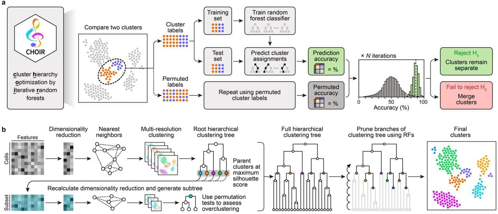

## tl;dr

## Overview

In April, Cathrin Sant, Lennar Mucke and M. Ryan Corces published their paper
CHOIR improves significance-based detection of cell types and states from 
single-cell data in 
[Nature Genetics](https://www.nature.com/articles/s41588-025-02148-8) (and 
their preprint is 
[freely avaiable here](https://www.biorxiv.org/content/10.1101/2024.01.18.576317v2)
). 

They address a well-known challenge in single-cell analyses: many published
analyses use clustering, an exploratory technique, to define subsets of cells
that (might) correspond to cell types or cell states. Yet, as Susan Holmes and 
Wolfgang Huber point out[^1] 

> [...] clustering methods will always deliver groups, even if there are none. 
If, in fact, there are no real clusters in the data, a hierarchical clustering 
tree may show relatively short inner branches; but it is difficult to quantify
this. In general it is important to validate your choice of clusters with more
objective criteria.

[^1]: In their excellent book 
[Modern Statistics for Modern Biology](https://www.huber.embl.de/msmb/):

In practice, single-cell clusters are usually defined an iterative way, with
manual interventions to split or combine subgroups based e.g. on the
expression of marker genes and other prior knowledge[^2]. This involves numerous
choices, e.g. the choice of variable features to consider, which dimensionality
reduction method to employ, how to create nearest neighbor graphs, the 
clustering method[^3] and its parameters, e.g. the _resolution_ that determines
the granularity of the final results.

The commonly used approaches [^4] readily subdivide homogeneous datasets (e.g.
without any actual subgroups) into clusters and invite speculation as to their
biological meaning.

[^2]: Afterwards, analysts often compare gene expression between the newly discovered 
clusters - and sometimes use the presence of differentially expressed genes as 
support for the biological validity of the identified subgroups. This approach
is flawed, because  clustering and differential expression on the same data 
_always_ creates apparent differences between the subgroups. See e.g. 
[Zhang et al](https://www.cell.com/cell-systems/fulltext/S2405-4712(19)30269-8),
[Neufeld et al](https://academic.oup.com/biostatistics/article/25/1/270/6893953)
or 
[Song et al](https://pmc.ncbi.nlm.nih.gov/articles/PMC10401959/)
for post-hoc methods to perform post-doc analyses in a rigorous way without
_double-dipping_.

[^3]: The [Louvain](https://en.wikipedia.org/wiki/Louvain_method) or 
[Leiden](https://www.nature.com/articles/s41598-019-41695-z) 
algorithms are popular choices.

[^4]: Including 
[Seurat's default workflow](https://satijalab.org/seurat/articles/pbmc3k_tutorial.html#cluster-the-cells)

Sant and co-workers developed `CHOIR`, a principled approach to reduce the risk 
of both over- and underclustering single-cell data, illustrated in 
[Figure 1](https://www.biorxiv.org/content/biorxiv/early/2025/02/19/2024.01.18.576317/F1.large.jpg) 
of their preprint (shown below). 

The main steps of the algorithm are:

1. Starting with the full dataset, `CHOIR` performs multiple rounds
of iterative clustering - each with higher resolution - to separate the cells
into a hierarchical tree of many possible clusters.
  - `CHOIR` keeps track of the parent-child relationships between clusters, e.g.
    how each parent cluster is split into two or more child clusters through
    subsequent clustering steps.
  - This step is designed to produce _overclustering_, e.g. the proposed
    clusters are smaller than they should be.
  - Clustering results depend on the choices made during data preprocessing,
    e.g. the selection of variable genes and dimensionality reduction. 
    Initially, the most variable genes might be markers of coarse cell types;
    but as the number of clusters increases, the same genes might not 
    distinguish finer distinctions (e.g. cell states) within them. `CHOIR` 
    therefore repeats the feature-selection and dimensionality reduction within
    each of the initial clusters, and uses these updated values for 
    sub-clustering.
    
2. Next, this overclustered hierarchical clustering tree is _pruned_, starting
with the leaves of the tree (e.g. the smallest clusters).
  - For each pair of sibling clusters (say `A` and `B`), `CHOIR` attempts to
  trains a random forest (RF) classifier[^5] on a balanced (e.g. downsampled)
  set of cells from each cluster, with the goal of assigning cells to the
  correct source (e.g. cluster `A` or `B`). Because the cluster assignments are
  known, the accuracy of the predictions can be determined. 
  - If classifier fails to achieve an accuracy of at least 0.5, the clusters are
  considered too similar and are merged. 
  - If the accuracy exceeds 0.5, a null distribution is created: the cluster
  labels are randomized and a second classifier is trained for comparison. 
  The whole process is repeated 100 times to estimate how much better the former
  classifier (performed on the actual assignments) performs compared to the
  latter (trained on randomized data).

If the RF classifier significantly (p < 0.05 after Bonferroni correction)
outperforms the randomized baseline, there is sufficient evidence to keep the
two clusters separate. If not, then the two candidate clusters are merged
instead.

::: {.callout-info collapse="true"}

### Additional features

`CHOIR`'s full implementation also includes harmonization of cells obtained
in different batches using 
[Harmony](https://www.nature.com/articles/s41592-019-0619-0), allows users to
specify batch covariates (and limit tests to within-batch comparisons) or to
employ 
[count splitting](https://academic.oup.com/biostatistics/article/25/1/270/6893953)
to avoid double-dipping.

For each pairwise comparison of candidate clusters, `CHOIR` records the 
accuracy of the trained classifiers, providing a metric of relatedness between
them. It also retains information about feature (gene) importances, which
might pinpoint useful marker genes.

:::

[^5]: Random forest classifiers are less prone to overfitting than other
statistical learning approaches and don't make distributional assumptions. They
can also highlight which features (e.g. genes) are most informative and might
therefore correspond to useful marker genes of a cluster.


In their paper, the authors systematically compare `CHOIR`'s performance to
that of other approaches using e.g.

- Simulated data
- Published single-cell RNA-seq data from a mixture of (many) immortalized cell
lines
- Multi-modal (e.g. single-cell RNA-seq accompanied by matching 
CITE-seq and sci-Space) data[^6]. 

[^6]: Clusters defined based solely on the scRNA-seq data are more likely to 
be biologically meaningful (aka true) if they also reveal differentially
abundant features in the other modality.

## Running CHOIR

The
[CHOIR R package](https://github.com/corceslab/CHOIR)
implements the algorithm and is accompanied by a 
[very nice vignette](https://www.choirclustering.com/articles/CHOIR.html)
to get users started. 

Let's step through the vignette, using the `LaMannoBrainData` scRNA-seq dataset
that is available via the
[scRNAseq Bioconductor package](https://www.bioconductor.org/packages/release/data/experiment/html/scRNAseq.html).

The package offers two different ways of running the algorithm, starting with 
either a `Seurat`, `SingleCellExperiment`, or `ArchR` object containing
normalized counts.

Using either the

1. `CHOIR` function to perform both steps of the analysis, or the
2. `buildTree` and `pruneTree` functions for more control over each step.

```{r}
library(CHOIR)
library(countsplit)
library(ggnewscale)
library(ragg)
library(scRNAseq)
library(Seurat)
```

The `LaMannoBrainData` function retrieves raw scRNA-seq data published by 
[La Manno et al](https://pubmed.ncbi.nlm.nih.gov/27716510/); 
here, we use a subset of the data collected from mouse adult dopaminergic
neurons. We store the raw count matrix in a Seurat object, and perform basic
quality filtering & normalization (using the default `LogNormalize` method).

```{r}
data_matrix <- LaMannoBrainData('mouse-adult')@assays@data$counts
colnames(data_matrix) <- seq(1:ncol(data_matrix))
object <- data_matrix  |> 
  CreateSeuratObject(
    min.features = 100,
    min.cells = 5) |>
  NormalizeData()
```

In this example, I will parallelize the analysis across two (local) CPUs:

```{r}
n_cores = 2
```

First, let's use the `CHOIR` wrapper function with default arguments.

```{r}
object <- CHOIR(object, n_cores = n_cores)  # <1>
```

1. Using additional cores speeds up the computation.

## Step-by-step

```{r}
object |>
  buildTree(n_cores = n_cores) |>
  pruneTree(n_cores = n_cores)
```

```{r}
head(object@meta.data)
```

```{r}
object <- runCHOIRumap(object, reduction = "P0_reduction")
```

```{r}
plotCHOIR(object)
```

```{r}
plotCHOIR(object,
          accuracy_scores = TRUE,
          plot_nearest = FALSE)
```

## Running CHOIR with Harmony batch correction / integration

```{r}
object <- CreateSeuratObject(data_matrix, 
                             min.features = 100,
                             min.cells = 5)
object <- NormalizeData(object)
object$batch <- sample(c("A", "B"), size = ncol(object), replace = TRUE)

object <- CHOIR(object, 
                batch_correction_method = "Harmony",
                batch_labels = "batch")
```

## Count splitting

[Reference](https://academic.oup.com/biostatistics/article/25/1/270/6893953)

```{r}
object <- CreateSeuratObject(data_matrix, 
                             min.features = 100,
                             min.cells = 5)
object <- NormalizeData(object)
object <- runCountSplit(object)
object@assays
```

```{r}
#| warning: false
object <- CHOIR(object,
                use_slot = "counts_log",
                countsplit = TRUE, 
                n_cores = n_cores)
```

## Reproducibility

<details>
<summary>
Session Information
</summary>

```{r}
sessionInfo()
```

</details>
