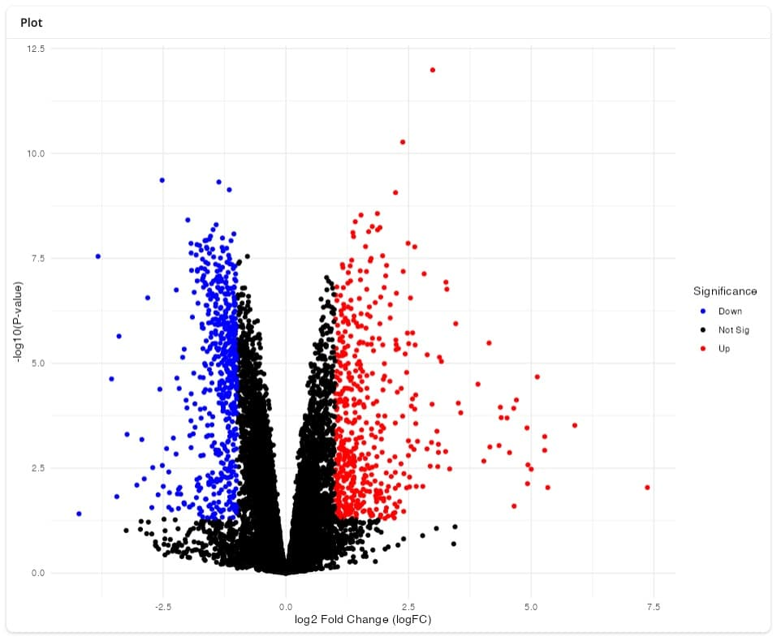
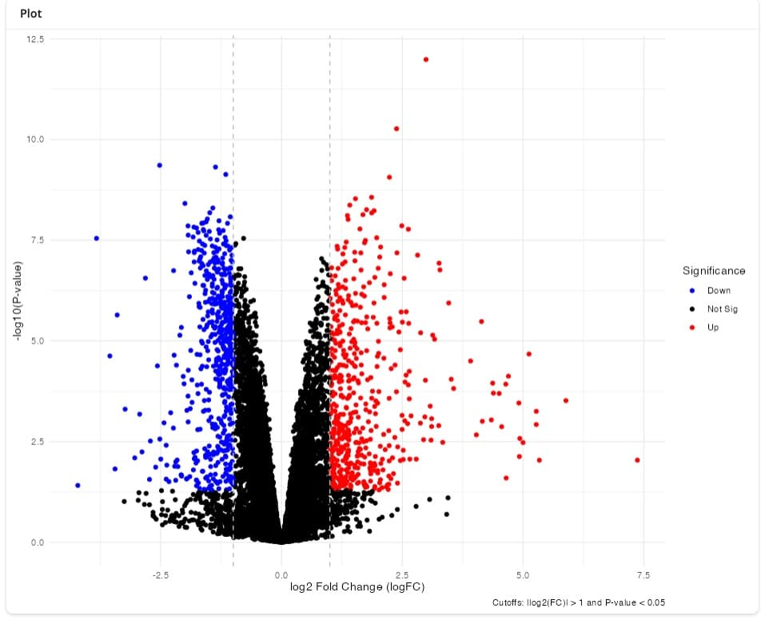
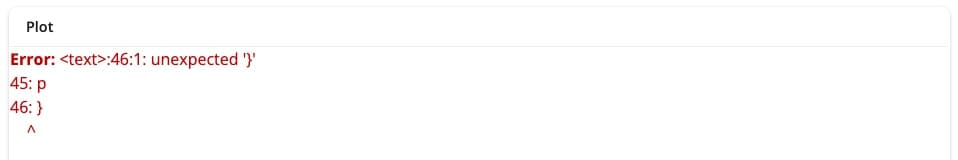
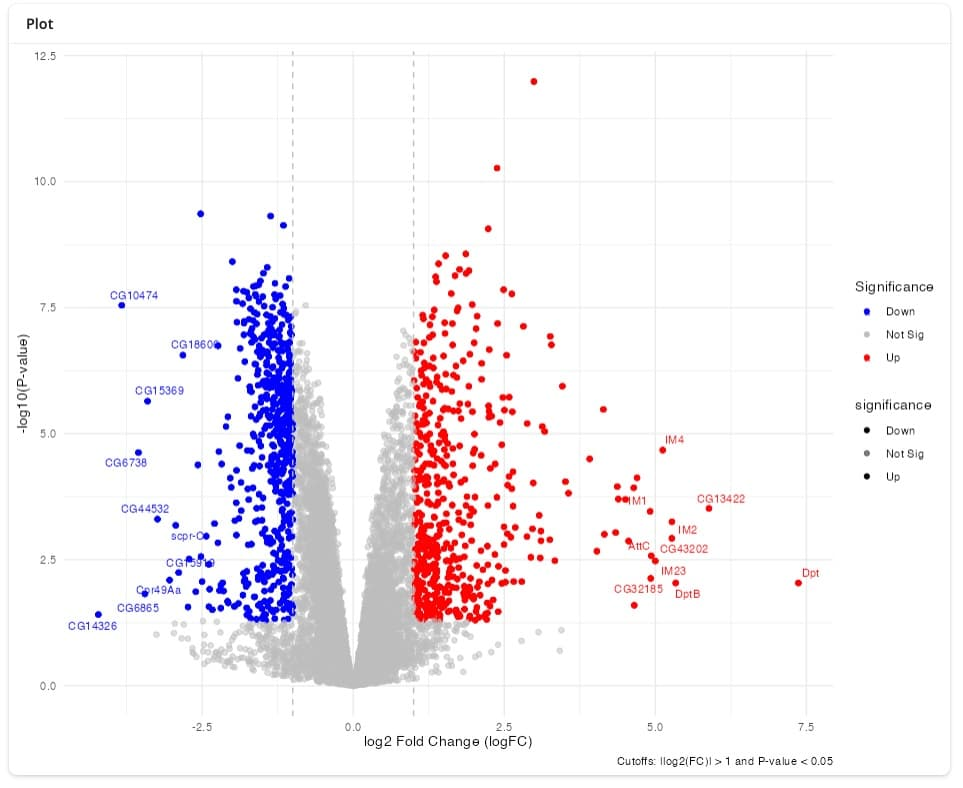
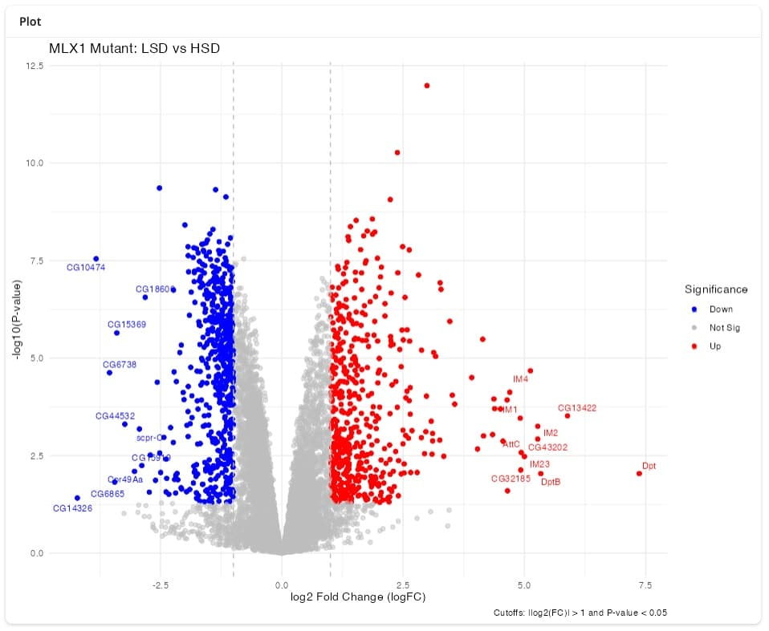

  
## tl;dr

- Today I experimented with the `ggbot2` R package, which connects a shiny
  app to openAI's `gpt-4.1` model to generate plots in R.
- After some experimentation, e.g. making sure that the required R packages
  were attached to the session, I was able to create a high-quality volcano
  plot, similar to a version I 
  [coded myself](https://tomsing1.github.io/blog/posts/volcano/index.html).
- `ggbot2` is a small R package, designed to demonstrate what is possible
  rather than to be used day-to-day. (I appreciate
  the ability to inspect (and document) the code that generates the figure.)
- I have lots of concerns about the use of LLMs, ranging from their
  environmental impact, illegal use of copyrighted material for training, 
  effect on communities of practice, surveillance and privacy, quality and
  reliability of their outputs, etc. For these
  and other reasons, I will stick to coding myself for the foreseeable future.
- But I can see how a thoughtful combination of natural-language processing 
  and voice recognition could lower the barrier of entry for data analysis and
  visualization[^1].
  
[^1]: I really appreciate Joe Cheng's measured approach to exploring LLMs
for data analysis, e.g. expressed in 
[his recent presentation](https://youtu.be/owDd1CJ17uQ&t=878). There is far too
much hype and snake oil salesmanship out there right now, but there is some
value as well.

## ggbot2

[Joe Cheng](https://github.com/jcheng5), 
[Sara Altman](https://github.com/skaltman) and
[Davis Vaughan](https://github.com/DavisVaughan)
showed off their [ggbot2](https://github.com/tidyverse/ggbot2)
R package at the recent 
[Posit conference](https://posit.co/conference/) to demonstrate how
multiple R packages from the 
[tidyverse](https://www.tidyverse.org) 
can be combined into a web application
that generates plots based on voice commands.

It caught my attention after I read Stephen Turner's 
[blog post](https://blog.stephenturner.us/p/voice-control-ggplot2-with-ggbot2),
and I decided to see how difficult it would be to recreate a volcano plot
that I had
[generated previously](https://tomsing1.github.io/blog/posts/volcano/index.html).

### Example data from Mattila et al, 2015

The data is from a differential expression analysis published by 
[Mattila et al, 2015](https://doi.org/10.1016/j.celrep.2015.08.081), who
compared gene expression profiles of _Drosophila_ larvae grown on a diet rich in
protein but low in sugar (LSD) with those exposed to a high-sugar diet (HSD) for
8 hours.

```{r}
#| message: false
#| warning: false
library(fs)
library(readxl)
```

The results (p-values, log2 fold changes, etc) are available in supplementary 
table S2 in the form of an excel file. Let's download it and extract only the
comparison of interest:

```{r}
df <- local({
  kUrl <- paste0(
    "https://drive.google.com/uc?export=download&",
    "id=1xWVyoSSrs4hoqf5zVRgGhZPRjNY_fx_7"
  )  
  temp_file <- tempfile(fileext = ".xlsx")
  download.file(kUrl, temp_file)
  readxl::read_excel(temp_file, sheet = "mlx1 mutant LSD vs. HSD", skip = 3)
})
head(df)
```

`ggbot2` relies on openAI's [GPT-4.1 model](https://openai.com/index/gpt-4-1/)
to transcribe voice into text and to generate code. To use it, I created an
openAI account and created an API key that are available in an `.Renviron` file
within my R project.

```{r}
library(ggbot2)
# optional, just making sure my API keys are found
got_api_keys <- ggbot2:::ensure_openai_api_key()
got_api_keys
```

Great, with my API key in place, I can pass the `df` data.frame to the `ggbot`
function, which launches a shiny app within my RStudio IDE.

To interact with the shiny app, I opened it in my internet browser by clicking
`Open in Browser`. Then I could activate the microphone button at the bottom of
the page to record & transmit my instructions.

::: {.callout-warn}

My first attempts at creating a volcano plot were unsuccessful, because the 
LLM attempted to use functions from R packages that were not installed (or
attached) to my R session, e.g. it attempted to use functions from the
`dplyr` R package. Later, when I instructed the model to add non-overlapping
text labels, it attempted to use the `ggrepel` package. I learned through
trial and error to attach these packages to the R session _before_ calling
`ggbot()`.

:::


### Voice-controlled plotting with ggplot2

```{r}
#| eval: false
library(dplyr)
library(ggrastr)
library(ggrepel)
ggbot2::ggbot(df)
```

With these dependencies in place, I was able to iteratively create a plot
that would make many of my collaborators happy, as well as the code that
generated it.

Here are my prompts and the results I got:

> This is a table with differential gene expression results. Please create a 
volcano plot and highlight significantly up- and down-regulated genes in red and 
blue, respectively.


> Please add vertical dashed lines to indicate the log2 cutoff, and add a 
caption that explains which cutoffs were applied.



> Please label top 10 up- and down-regulated genes, respectively, and make sure
the labels don't overlap.


> Please change the color of the non-significant points to grey, and make them
semi-transparent.



> That didn't work, please try again.



> Please remove the second legend that shows the transparency of the three 
categories.


> Please add the title "Mlx1 mutant LSD vs. HSD"



> Instead of plotting all of the points, please use the ggrastr package
to create a rasterized image instead.

Here is the final code, written entirely by the LLM [^2], and its output
(rendered in my R session, not within the shiny app) [^3]

[^2]: Note the missing declaration of the `dplyr` dependency, e.g. this code
will only run if the `dplyr` library has been attached to the session
previously.

[^3]: As will most LLM setups, every `ggbot2` session will yield slightly
different results, so your mileage will vary.

```{r}
#| fig-width: 7
#| fig-height: 7
library(ggplot2)
library(ggrepel)
library(ggrastr)

# Define significance thresholds
logFC_threshold <- 1
pvalue_threshold <- 0.05

# Create a new column for significance status
df <- df %>% 
  mutate(significance = case_when(
    logFC >= logFC_threshold & P.Value <= pvalue_threshold ~ 'Up',
    logFC <= -logFC_threshold & P.Value <= pvalue_threshold ~ 'Down',
    TRUE ~ 'Not Sig'
  ))

# Get top 10 up-regulated genes
up_genes <- df %>% 
  filter(significance == 'Up') %>% 
  arrange(-logFC) %>% 
  head(10)

# Get top 10 down-regulated genes
down_genes <- df %>% 
  filter(significance == 'Down') %>% 
  arrange(logFC) %>% 
  head(10)

# Combine top up and down genes
top_genes <- bind_rows(up_genes, down_genes)

# Generate the volcano plot using rasterized points, remove alpha legend, and 
# add title
p <- ggplot(df, aes(x = logFC, y = -log10(P.Value), color = significance)) +
  geom_point_rast(aes(alpha = significance)) +
  scale_color_manual(values = c('Up' = 'red', 
                                'Down' = 'blue',
                                'Not Sig' = 'gray')) +
  scale_alpha_manual(values = c('Up' = 1, 
                                'Down' = 1, 
                                'Not Sig' = 0.5), guide = 'none') +
  geom_vline(xintercept = c(-logFC_threshold, logFC_threshold), 
             linetype = 'dashed', color = 'gray') +
  geom_text_repel(data = top_genes, aes(label = Symbol), size = 3) +
  labs(
    title = 'MLX1 Mutant: LSD vs HSD',
    x = 'log2 Fold Change (logFC)', 
    y = '-log10(P-value)', 
    color = 'Significance',
    caption = paste('Cutoffs: |log2(FC)| >', logFC_threshold, 
                    'and P-value <', pvalue_threshold)
  ) +
  theme_minimal()

p
```

Does an experienced analyst need to use multiple calls to an LLM to generate
this volcano plot (at the expense of water, electricity and funds)? No, of
course not. 

But in my work as a Computational Biologist, I interact with many 
colleagues for whom writing code is a barrier and who rely on me to tweak
figures e.g. for publications. They already chat with LLMs, and would likely
appreciate being able to talk to them as well. 

`ggbot2` is an instructive example how these tools can be integrated into the
stack of tools I use, within an environment with defined dependencies that can
be recorded and audited (e.g. in the session information below).

For professional use, it would be great to interact with either a local LLM,
avoiding any data transfer, or use an LLM provider that is securely
integrated into my workplace.

But I have to admit, the ability to create and modify a plot simply by talking
to my computer is wondrous - even if I will stick to coding for the foreseeable
future.

## Reproducibility

::: {.callout-note collapse="true"}

### Session Information ℹ️

```{r}
sessioninfo::session_info()
```

:::
