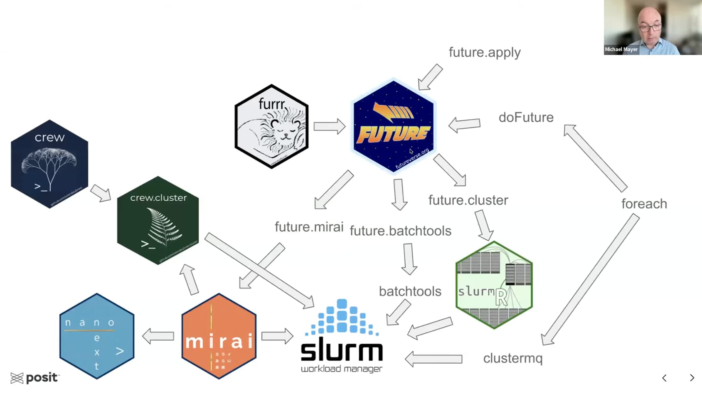

## tl;dr

Today I learned how to create a high performance compute (HPC) cluster on my 
local system using `docker` and `docker-compose` with the [slurm-docker-cluster](https://github.com/giovtorres/slurm-docker-cluster)
project. It allowed me to experiment with an HPC environment and with the SLURM 
scheduler - using either its native commands (e.g. `srun` and 
`sbatch`) or from within R (e.g. with the
[clustermq](https://mschubert.github.io/clustermq/) package) - all from the
comfort of my own laptop (a Macbook Air M4 with Mac OS 26.0.1).

## Motivation

This week, I watched the 
[recording of Michael Mayer's workshop](https://youtu.be/gkEoNlYtUaQ)
"Selected examples on how to scale-up computations in R (by using HPC)" from
the 2024 R/Pharma conference.

He covers part of the 
[extensive R package ecosystem](https://youtu.be/gkEoNlYtUaQ?si=rp_ueR4J8S4Z53Ra&t=7793)
that allows users to execute workloads on high performance compute cluster 
(HPCs), e.g. using the 
[SLURM](https://en.wikipedia.org/wiki/Slurm_Workload_Manager) workload manager.



Many scientific organizations use 
[high performance compute (HPC)](https://en.wikipedia.org/wiki/High-performance_computing)
clusters to parallelize workloads. I wanted to refresh my memory of how to work
with an HPC, e.g. using the growing set of R package that interface with 
different backends. I considered spinning up a cluster in the cloud, e.g. using 
[AWS ParallelCluster](https://docs.aws.amazon.com/parallelcluster), but that
seemed like (potentially expensive) overkill for my learning goal. Luckily,
I discovered Giovanni Torres' 
[slurm-docker-cluster](https://github.com/giovtorres/slurm-docker-cluster)
project, which allowed me to create a small cluster that uses the 
[SLURM](https://slurm.schedmd.com/) 
scheduler using `docker` and `docker-compose` on my local system[^1]. 

This setup does not miraculously generate more compute resources, but it allows
me to experiment with my very own HPC, e.g. submit jobs, write batch scripts and 
monitor job queues. On the way, I learned about docker-compose overrides, Rocky
Linux, globally setting a CRAN mirror, and more!

[^1]: An M4 Macbook with a 10-core CPU and 16 GB of RAM.

### Dependencies

The cluster will constitute multiple docker containers and docker volumes, so
we need to have both 
[docker](https://docs.docker.com/get-started/get-docker/) 
and 
[docker-compose](https://docs.docker.com/compose/install/) 
available on our system.

## Setting up a local cluster with `slurm-docker-cluster`

We start by cloning the latest commits from
[slurm-docker-cluster](https://github.com/giovtorres/slurm-docker-cluster)
repository to our local system and change into its root directory.

```{bash}
#| eval: false
#| results: hide
git clone --depth=1 https://github.com/giovtorres/slurm-docker-cluster.git
cd slurm-docker-cluster
```

```
Cloning into 'slurm-docker-cluster'...

remote: Enumerating objects: 218, done.
remote: Counting objects: 100% (141/141), done.
remote: Compressing objects: 100% (67/67), done.
remote: Total 218 (delta 96), reused 88 (delta 65), pack-reused 77 (from 2)
Receiving objects: 100% (218/218), 74.00 KiB | 658.00 KiB/s, done.
Resolving deltas: 100% (109/109), done.
```

The project supports multiple SLURM versions, which can be configured in a
`.env` file in the repository's root directory. To use SLURM version `25.05.3`
we copy the included example:

```{bash}
#| eval: false
cp .env.example .env
cat .env
```

<details>
<summary>
Example .env file
</summary>

```
# Slurm version (semantic version format)
# Supported versions: 25.05.x, 24.11.x
# This is used for:
#   - Downloading the Slurm tarball from schedmd.com
#   - Tagging the Docker image
#   - Selecting version-specific configuration files
#
# Examples:
#   SLURM_VERSION=25.05.3   # Latest stable (default)
#   SLURM_VERSION=24.11.6   # Previous stable release
SLURM_VERSION=25.05.3

# MySQL credentials
# The defaults are only suitable for local development/testing
MYSQL_USER=slurm
MYSQL_PASSWORD=password
MYSQL_DATABASE=slurm_acct_db
```
</details>

To create a high performance cluster (HPC) we first need to build the 
`slurm-docker-cluster` docker image using the
[repository's Dockerfile](https://github.com/giovtorres/slurm-docker-cluster/blob/main/Dockerfile)
).

The `Makefile` includes a set of helpful commands, including `make help`
to see all of them:

```{bash}
#| eval: false
make help
```

<details>
<summary>
Available Commands
</summary>

```
Slurm Docker Cluster - Available Commands
==========================================

Cluster Management:
  build           Build Docker images
  up              Start containers
  down            Stop containers
  clean           Remove containers and volumes
  rebuild         Clean, rebuild, and start

Quick Commands:
  jobs            View job queue
  status          Show cluster status
  logs            Show all container logs
  logs-slurmctld  Show slurmctld logs
  logs-slurmdbd   Show slurmdbd logs

Configuration Management:
  update-slurm    Update config files (requires FILES="...")
  reload-slurm    Reload Slurm config without restart

Development & Testing:
  shell           Open shell in slurmctld
  test            Run test suite
  quick-test      Submit a quick test job
  run-examples    Run example jobs

Multi-Version Support:
  version         Show current Slurm version
  set-version     Set Slurm version (requires VER=...)
  build-all       Build all supported versions
  test-version    Test a specific version (requires VER=...)
  test-all        Test all supported versions
```
</details>

### Building the `slurm-docker-cluster` image

To get started, let's use the `make build` command to build the docker image,
including all of SLURM and its dependencies[^2].

[^2]: The image is based on the highly stable
[Rocky Linux (v9)](https://rockylinux.org)
distribution.

⏳ Please note that building the image from scratch takes a few minutes.

```{bash}
#| results: hide
#| eval: false
make build
```

Once the image is available, we can spin up a small HPC with the `make up`
command. The cluster consists of six docker containers, including the 
`slurmctld` 
[head node](https://slurm.schedmd.com/quickstart_admin.html#ctld) 
and two 
[compute nodes](https://slurm.schedmd.com/quickstart_admin.html#compute) 
(`c1` and `c2`).

### Starting and testing the cluster

```{bash}
#| results: hide
#| eval: false
make up
```

```
[+] Running 7/7
 ✔ Network slurm-docker-cluster_slurm-network  Created
 ✔ Container mysql                             Healthy
 ✔ Container slurmdbd                          Healthy
 ✔ Container slurmctld                         Healthy
 ✔ Container slurmrestd                        Started
 ✔ Container c1                                Started
 ✔ Container c2                                Started
```

We can get additional information about the containers and the cluster with the
`make status` command, which shows that there is one partition (e.g. the 
default queue) called `normal` with two compute nodes.

```{bash}
#| results: hide
#| eval: false
make status
```

```
=== Containers ===

NAME         IMAGE                          COMMAND                  SERVICE      CREATED              STATUS                        PORTS
c1           slurm-docker-cluster:25.05.3   "/usr/local/bin/dock…"   c1           About a minute ago   Up 49 seconds (healthy)       6818/tcp
c2           slurm-docker-cluster:25.05.3   "/usr/local/bin/dock…"   c2           About a minute ago   Up 49 seconds (healthy)       6818/tcp
mysql        mariadb:12                     "docker-entrypoint.s…"   mysql        About a minute ago   Up About a minute (healthy)   3306/tcp
slurmctld    slurm-docker-cluster:25.05.3   "/usr/local/bin/dock…"   slurmctld    About a minute ago   Up 54 seconds (healthy)       6817/tcp
slurmdbd     slurm-docker-cluster:25.05.3   "/usr/local/bin/dock…"   slurmdbd     About a minute ago   Up About a minute (healthy)   6819/tcp
slurmrestd   slurm-docker-cluster:25.05.3   "/usr/local/bin/dock…"   slurmrestd   About a minute ago   Up 49 seconds (healthy)       0.0.0.0:6820->6820/tcp, [::]:6820->6820/tcp

=== Cluster ===
PARTITION AVAIL  TIMELIMIT  NODES  STATE NODELIST
normal*      up   infinite      2   idle c[1-2]
```

To see our cluster in action, we can run the test suite:

```{bash}
#| results: hide
#| eval: false
make test
```

<details>
<summary>
Test results
</summary>

```
./test_cluster.sh

================================
Slurm Docker Cluster Test Suite (v25.05.3)
================================

[TEST] Checking if all containers are running...
[INFO]   ✓ mysql is running
[INFO]   ✓ slurmdbd is running
[INFO]   ✓ slurmctld is running
[INFO]   ✓ slurmrestd is running
[INFO]   ✓ 2 worker node(s) running
[PASS] All containers are running
[TEST] Testing MUNGE authentication...
[PASS] MUNGE authentication is working
[TEST] Testing MySQL database connection...
[PASS] MySQL connection successful
[TEST] Testing slurmdbd daemon...
[PASS] slurmdbd is responding and cluster is registered
[TEST] Testing slurmctld daemon...
[PASS] slurmctld is responding
[TEST] Testing compute nodes availability...
[PASS]        2 compute node(s) are available (matches expected 2)
[TEST] Testing compute nodes state...
[PASS] Compute nodes are in idle state (1 nodes)
[TEST] Testing partition configuration...
[PASS] Default partition 'normal' exists
[TEST] Testing job submission...
[INFO]   Job ID: 1 submitted
[PASS] Job submitted successfully (Job ID: 1)
[TEST] Testing job execution and output...
[PASS] Job executed and produced output
[TEST] Testing job accounting...
[PASS] Job accounting is working
[TEST] Testing multi-node job allocation...
[PASS] Multi-node job executed on 2 nodes
[TEST] Testing resource limit configuration...
[PASS] Resource limits configured correctly

================================
Test Summary
================================
Tests Run:    13
Tests Passed: 13
Tests Failed: 0

✓ All tests passed!
```

</details>

All of the tests passed! 

### Logging into the head node

We can log into the cluster's 
[head node](https://slurm.schedmd.com/quickstart_admin.html#ctld)
(as root) with `make shell`

```{bash}
#| results: hide
#| eval: false
make shell
```

and interact with SLURM with its 
[command line utilities](https://slurm.schedmd.com/pdfs/summary.pdf) 
e.g. `srun`, `sbatch`, `squeue`, etc.

```
[root@slurmctld data]# sbatch --version
slurm 25.05.3
```

### Shutting down the cluster

We can shut down the cluster with the `make down`
command. Please note that its docker `volumes` will persist[^3], e.g. files
stored in the `/data` folder that is shared between the nodes will remain
available when the cluster is started up again later.

[^3]: The [persistent volumes](https://github.com/giovtorres/slurm-docker-cluster#persistent-volumes)
are:
```
- etc_munge: Mounted to /etc/munge - Authentication keys
- etc_slurm: Mounted to /etc/slurm - Configuration files (allows live editing)
- slurm_jobdir: Mounted to /data - Job files shared across all nodes
- var_lib_mysql: Mounted to /var/lib/mysql - Database persistence
- var_log_slurm: Mounted to /var/log/slurm - Log files
```

```{bash}
#| results: hide
#| eval: false
make down
```

##  Adding R and clustermq

Each of the cluster's nodes is instantiated from the `slurm-docker-cluster` 
docker image. For scientific applications, we might need additional tooling[^4].
In a production HPC, tools are often provided by the cluster's administrators,
e.g. using 
[modules](https://arctraining.github.io/hpc1/modules-software.html)
or package managers like 
[spack](https://spack.io/) 
or 
[EasyBuild](https://easybuild.io/).

I am primarily interested in learning how to submit workloads from an 
interactive `R` session. But `R` is currently not available on any of the nodes.
I could interactively install `R` after starting the cluster[^5], but because
it is not part of the original docker image I would need to repeat this step
every time the cluster is restarted.

[^4]: Trevor Vincent maintains the 
[awesome-high-perfomance-computing](https://github.com/trevor-vincent/awesome-high-performance-computing)
list of resources.

[^5]: For example, with the cluster running, I could execute the installation
instructions within the three nodes with the `docker exec` command:
```
for NODE in slurmctld c1 c2
do
  docker exec -it $NODE bash -lc "yum install -y epel-release R-base"
done
```

Luckily, there is a more permanent solution: Because the cluster is set up using
`docker-compose`, I can add a second configuration file (a 
[docker-compose-override file](https://docs.docker.com/compose/how-tos/multiple-compose-files/merge/)) 
that inserts another `docker build` step before each of the containers is 
started.

### A second Dockerfile 

Let's tackle this task in two steps. First, we create a small `Dockerfile`,
called `Dockerfile.r` to distinguish it from the existing `Dockerfile`,
based on the `slurm-docker-cluster` image we built with `make build` above.

```{bash}
#| results: hide
#| eval: false
cat > Dockerfile.r << 'EOF'  # <1>
ARG SLURM_VERSION # <2>
FROM slurm-docker-cluster:${SLURM_VERSION}
USER root
RUN dnf -y install epel-release \  # <3>
 && dnf -y install R-base zeromq-devel \  # <4>
 && dnf clean all
RUN cat > /usr/lib64/R/etc/Rprofile.site <<'REOF'  # <5>
options(repos = c(CRAN = sprintf("https://packagemanager.posit.co/cran/latest/bin/linux/rhel9-%s/%s",
  R.version["arch"], substr(getRversion(), 1, 3))))
REOF
RUN R -q -e 'install.packages(c("clustermq", "callr"))' # <6>
EOF
```

1. Instead of creating the `Dockerfile.r` file manually, I am writing the
file using the 
[Here Document](https://tldp.org/LDP/abs/html/here-docs.html) notation, e.g.
the first and last line of this code chunk are not included in the file;
they redirect the enclosed content to it.

2. The `SLURM_VERSION` will be provided by `docker-compose`, see below.

3. The `R-base` package for Rocky Linux (or RHEL9) is included in the 
[Extra Packages for Enterprise Linux (EPEL) repository](https://docs.fedoraproject.org/en-US/epel/)
so we make it available first. 

4. Next, the `R-base` and `zeromq-devel` packages are added to the docker image.
([ZeroMQ](https://zeromq.org) is a dependency of the `clustermq` R package.)

5. To speed up the installation of R packages in the future, we can take
advantage of binaries compiled for RHEL9 and hosted by
[Posit's Public Package Manager](https://packagemanager.posit.co/client/#/).
To ensure that this repository is used by default, we create the `Rprofile.site`
file, which is executed at the start of every R session.

6. Because I am planning to experiment with the
[clustermq R package](https://cran.r-project.org/package=clustermq) 
to submit jobs interactively, let's also install it - together with its optional
`callr` dependency. If additional packages would be useful in the future,
they could be added here as well.

### Merging two docker-compose files

```{bash}
#| results: hide
#| eval: false
cat > docker-compose.override.r.yml << 'EOF'  # <1>
x-node-build: &node-build  # <2>
  context: .
  dockerfile: Dockerfile.r  # <3>
  args:
    SLURM_VERSION: ${SLURM_VERSION:-25.05.3} # <4>
    BASE_IMAGE: slurm-docker-cluster:${SLURM_VERSION:-25.05.3}

services:
  slurmctld:
    image: slurm-docker-cluster-r:${SLURM_VERSION:-25.05.3} # <5>
    build: *node-build

  c1:
    image: slurm-docker-cluster-r:${SLURM_VERSION:-25.05.3}
    build: *node-build

  c2:
    image: slurm-docker-cluster-r:${SLURM_VERSION:-25.05.3}
    build: *node-build
EOF
```

1. As above, the `docker-compose.override.r.yml` file is created as a
[Here Document](https://tldp.org/LDP/abs/html/here-docs.html).

2. Because we want to add the `Dockerfile.r` build to each of the three
nodes, the repetitive part of the configuration is defined in an
[Extension](https://docs.docker.com/reference/compose-file/extension/) at the
top of the file, defined as a
[YAML anchor ](https://docs.docker.com/reference/compose-file/fragments/)
(with the `node-build` alias),
and then referenced as `*node-build` in each of the services below.

3. The `Dockerfile.r` file we created above (in the same directory) is used
to drive the build of a new image, on top of our `BASE_IMAGE`.

4. The `SLURM_VERSION` argument is provided in the `.env` file, which is
automatically read by `docker-compose`. As a fallback option, I also define
version `25.05.3` in case it is undefined.

5. The services section overrides the instructions in the original 
`docker-compose.yml` file for the three (node) services and instructs them to
use the modified image (based on `Dockerfile.r`) instead. We specify a new
name for the image (note the `-r` suffix) to avoid overwriting the original base
image.

### Building the custom image

With both the `Dockerfile.r` and the `docker-compose.override.r.yml` files in
place, we can trigger a rebuild of the three services.

```{bash}
#| results: hide
#| eval: false
docker compose \  # <1>
  -f docker-compose.yml \ # <2>
  -f docker-compose.override.r.yml \
  build slurmctld c1 c2 # <3>
```

1. We use `docker compose` directly instead of `make build` to pass custom
arguments.

2. By using the `-f` argument twice, we trigger the merge (override) of the
two YAML files.

3. We specifically rebuild the three specified services (e.g. the head and 
compute nodes).

Afterwards, we can verify that the new images have been created and are 
available to instantiate containers:

```{bash}
#| results: hide
#| eval: false
docker images
```

```
REPOSITORY               TAG       IMAGE ID       CREATED          SIZE
slurm-docker-cluster-r   25.05.3   cf033fce4f95   23 seconds ago   1.63GB
slurm-docker-cluster     25.05.3   685254b2ae7e   8 minutes ago    1.49GB
mariadb                  12        d80ec225ce9d   5 days ago       357MB
```

### (Re)starting the cluster

We are ready to spin up our cluster again, this time using the new service
definitions.

```{bash}
#| results: hide
#| eval: false
docker compose \ <#1>
  -f docker-compose.yml \
  -f docker-compose.override.r.yml \
  up -d
```

1. As above, we use `docker compose` directly instead of `make up` to pass
custom arguments.

Once the cluster is available, we can verify that `R` is available on all 
three nodes, e.g. by retrieving the version of the `clustermq` package.

```{bash}
#| results: hide
#| eval: false
for NODE in slurmctld c1 c2
do
	echo ">>> Node" $NODE  # <1>
	docker exec -it $NODE \  # <2>
	  R --vanilla -s -e \
	    "paste('clustermq', installed.packages()['clustermq', 'Version'])"
done
```

1. We print the node's name to verify that the results come from the expected 
system.

2. The `docker exec -it $NODE` command executes the code in the
specified node, all of which are now based on the `slurm-docker-cluster-r` 
docker image and have both R and the `clustermq` R package installed:

```
>>> Node slurmctld
[1] "clustermq 0.9.9"
>>> Node c1
[1] "clustermq 0.9.9"
>>> Node c2
[1] "clustermq 0.9.9"
```

## Interactively submitting jobs with clustermq

Now we are ready to experiment with running analysis code in a distributed
fashion, e.g. parallelizing a function call across the compute nodes of our HPC
cluster. We start by logging into the head node, using the `make shell`
helper.

```{bash}
#| results: hide
#| eval: false
make shell
```

Within the head node, we first create the SLURM template file for
`clustermq`, as described in the 
[clustermq documentation](https://mschubert.github.io/clustermq/articles/userguide.html#slurm).
(By placing it into the shared `/data` directory, which is mapped to a 
persistent volume that is accessible from all nodes, we can reuse it even after
our cluster has been shut down and restarted.)

```{bash}
#| results: hide
#| eval: false
cat > /data/slurm.tmpl << 'EOF'. # <1>
#!/bin/sh
#SBATCH --job-name={{ job_name }}
#SBATCH --partition=normal  # <2>
#SBATCH --output={{ log_file | /dev/null }}
#SBATCH --error={{ log_file | /dev/null }}
#SBATCH --mem-per-cpu={{ memory | 4096 }}
#SBATCH --array=1-{{ n_jobs }}
#SBATCH --cpus-per-task={{ cores | 1 }}

ulimit -v $(( 1024 * {{ memory | 4096 }} ))
CMQ_AUTH={{ auth }} R --no-save --no-restore -e 'clustermq:::worker("{{ master }}")'
EOF
```

1. As above, we write the file using a Here Document.

2. Our cluster has only one (default) partition called `normal`, but we specify
it here just for future reference.

Next, still within the shell of the head node, we start an interactive R
session.

```{bash}
#| results: hide
#| eval: false
R --vanilla
```

In R, we first attach the `clustermq` package, which sends function calls as 
jobs to the compute cluster. Its `Q()` function does all of the heavy lifting.

First, we define a simple test function that returns the name of the node
it is executed on, followed by a user-provided index. 

### Multiprocess execution

First, let's run the code only on the local cores of the head node, by 
specifying the `multiprocess` scheduler. We provide ten indices (`i`), 
triggering ten parallel executions using the two cores available to the
`slurmctld` node.

```{r}
#| eval: false
library(clustermq)
options(
    clustermq.scheduler = "multiprocess"
)

test_fun <- function(i) {
  paste(Sys.info()[["nodename"]], i)
}

res <- Q(
  fun = test_fun,
  i   = 1:10,
  n_jobs = 2,          
  timeout = 60
)
print(res)
```

As expected, each of the returned results reports that it was obtained from
the `slurmctld` node.

<details>
<summary>
Results
</summary>

```
Starting 2 processes ...
Running 10 calculations (5 objs/20.1 Kb common; 1 calls/chunk) ...
Master: [0.3 secs 32.7% CPU]; Worker: [avg 100.4% CPU, max 231.6 Mb]
[[1]]
[1] "slurmctld 1"

[[2]]
[1] "slurmctld 2"

[[3]]
[1] "slurmctld 3"

[[4]]
[1] "slurmctld 4"

[[5]]
[1] "slurmctld 5"

[[6]]
[1] "slurmctld 6"

[[7]]
[1] "slurmctld 7"

[[8]]
[1] "slurmctld 8"

[[9]]
[1] "slurmctld 9"

[[10]]
[1] "slurmctld 10"
```
</details>

Great, that worked. Now let's use the `SLURM` scheduler to run the jobs
on the two compute nodes (`c1` and `c2`).

```{r}
#| eval: false
options(
  clustermq.scheduler = "slurm",  # <1> 
  clustermq.template  = "/data/slurm.tmpl"  # <2>
)

res <- Q(
  fun = test_fun,
  i   = 1:10,
  n_jobs = 2,          # maps to SLURM array size
  memory = 1000,       # up to 1000 MB per CPU
  timeout = 60
)
print(res)
```

1. We instruct `clustermq` to use the `slurm` scheduler

2. Using the `/data/slurm.tmpl` file we generated above.

The results are now generated on the two compute nodes:

<details>
<summary>
Results
</summary>

```
Submitting 2 worker jobs to SLURM as ‘cmq8141’ ...
Running 10 calculations (5 objs/20.1 Kb common; 1 calls/chunk) ...
Master: [0.7 secs 1.4% CPU]; Worker: [avg 51.5% CPU, max 230.4 Mb]            
[[1]]
[1] "c1 1"

[[2]]
[1] "c1 2"

[[3]]
[1] "c2 3"

[[4]]
[1] "c1 4"

[[5]]
[1] "c2 5"

[[6]]
[1] "c1 6"

[[7]]
[1] "c2 7"

[[8]]
[1] "c1 8"

[[9]]
[1] "c2 9"

[[10]]
[1] "c2 10"
```
</details>

Success! We have successfully executed our simple test function within the HPC
cluster.

We can quit the interactive R session

```{r}
#| eval: false
q()
```

and then log out of the head node by exiting the shell.

```{bash}
#| eval: false
exit
```

## Cleanup

First, let's stop the containers that make up our small HPC.

```{bash}
#| eval: false
make down
```

```
docker compose down
[+] Running 7/7
 ✔ Container c2                                Removed  0.1s 
 ✔ Container slurmrestd                        Removed  1.2s 
 ✔ Container c1                                Removed  0.2s 
 ✔ Container slurmctld                         Removed  0.1s 
 ✔ Container slurmdbd                          Removed  0.1s 
 ✔ Container mysql                             Removed  0.4s 
 ✔ Network slurm-docker-cluster_slurm-network  Removed  0.3s
 ```

Next, we clean up the persistent volumes that were created by `docker-compose`.

```{bash}
#| eval: false
make clean
```

```
docker compose down -v
[+] Running 5/5
 ✔ Volume slurm-docker-cluster_var_log_slurm  Removed 0.0s 
 ✔ Volume slurm-docker-cluster_etc_munge      Removed 0.0s 
 ✔ Volume slurm-docker-cluster_etc_slurm      Removed 0.0s 
 ✔ Volume slurm-docker-cluster_slurm_jobdir   Removed 0.0s 
 ✔ Volume slurm-docker-cluster_var_lib_mysql  Removed 0.0s 
```

If we don't want to spin the cluster back up in the future, we can also
remove the four docker images that we created, releasing storage on the system.

```{bash}
#| eval: false
docker rmi \
  slurm-docker-cluster:25.05.3 \
  slurm-docker-cluster-r:25.05.3 \
  mariadb:12
```

We could also decide to clean the docker build cache, freeing even more disk 
capacity. (But please beware that this will remove the _entire_ docker cache,
not just layers associated with this tutorial).

```{bash}
#| eval: false
docker buildx prune --all --force
```
