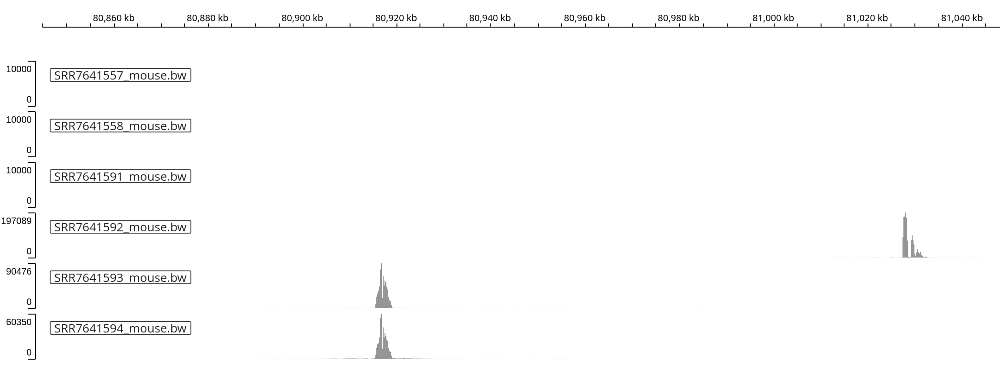
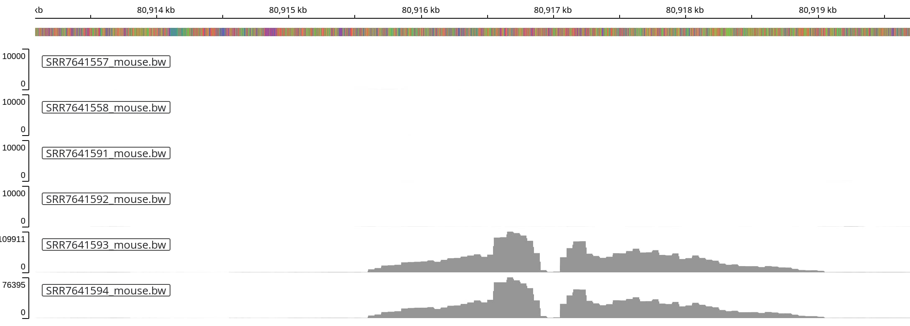
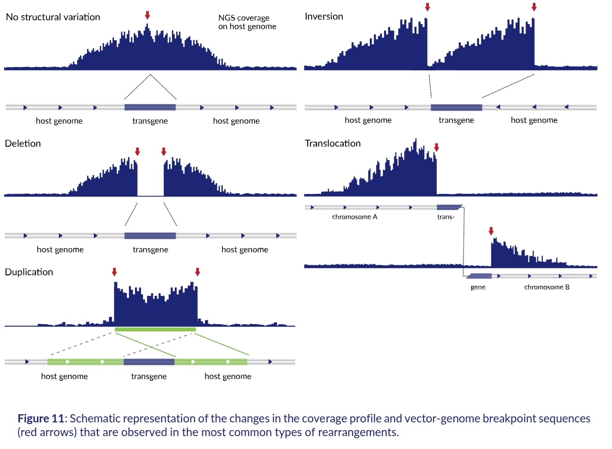
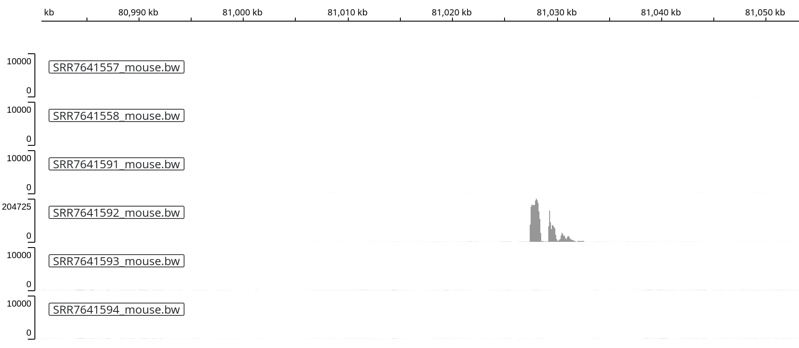
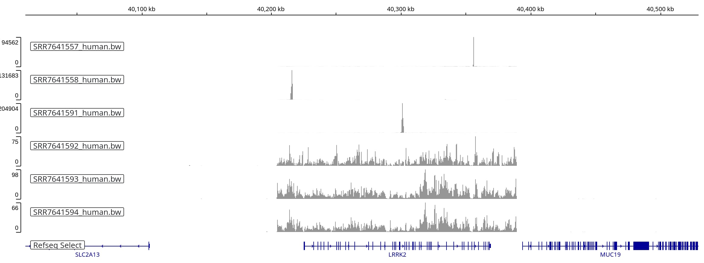
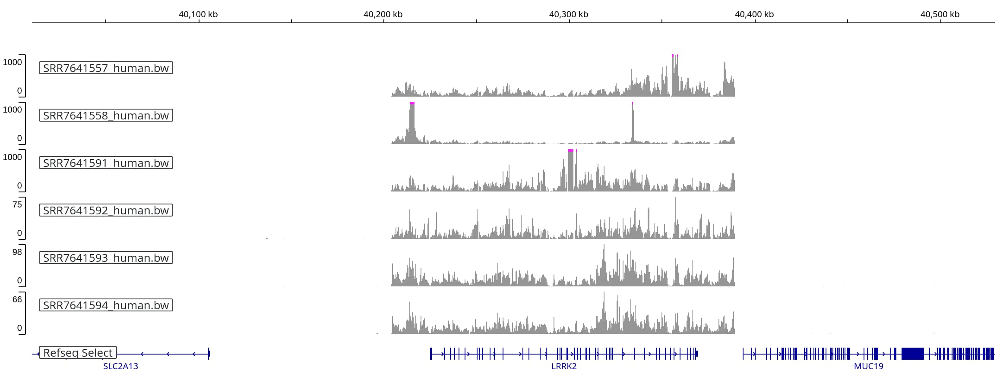
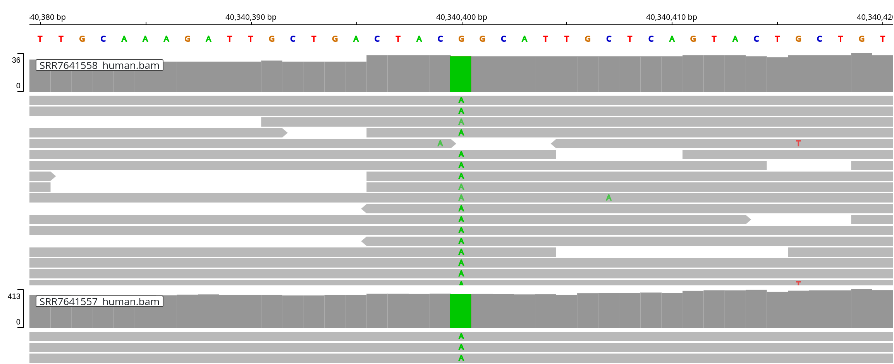

## tl;dr

This week, I had the chance to learn about a technique that was new to me:
targeted locus amplification (TLA), initially described by 
[de Vree et al, Nature Biotechnology](https://pubmed.ncbi.nlm.nih.gov/25129690/)
in 2014[^1].

Starting with a set of PCR primers, it captures sequences up to ~ 100 kb on 
either side of them. This targeted library preparation method can be used e.g.
to identify the insertion site of transgenes, or to study structural variation
of specific genes of interest.

Here, I am taking a closer look at published TLA data that reveals details about
commonly used transgenic mouse models.

[^1]: The full text of the article is available via [ResearchGate](https://www.researchgate.net/publication/267624474_Targeted_sequencing_by_proximity_ligation_for_comprehensive_variant_detection_and_local_haplotyping).

## A basic overview of TLA

The goal of the TLA library preparation method is to capture genomic fragments
that are in close proximity to a known sequence. The following steps are 
illustrated in the great figure by de Vree et al shown below[^2]:

[^2]: The full protocol developed by de Vree et al is included in the
[supplementary information](https://static-content.springer.com/esm/art%3A10.1038%2Fnbt.2959/MediaObjects/41587_2014_BFnbt2959_MOESM1_ESM.pdf) alongside helpful illustrations and
numerous examples of TLA applied to different use cases.

::: {.callout-note collapse="true"}

### Protocol details

1. The protocol starts with a cell pellet, resuspended in PBS with 10% BSA.
2. The chromatin is cross-linked with formaldehyde, locking DNA fragments that
  are in close proximity to each other in place.
3. Next, the cells are lysed and the DNA is digested with 
  [NlaIII](https://www.neb.com/en-us/products/r0125-nlaiii), a restriction 
  enzyme that recognizes a 4 base pair sequence. Because these 4-mer motifs
  appear frequently in the genome this digestion step leads to short
  fragments. 
4. Afterwards, the restriction enzyme is heat inactivated and the DNA ends are
  ligated, creating large DNA circles composed of multiple crosslinked 
  restriction fragments. At this point, the cross-links are reversed and the
  DNA is purified using proteinase K digestions and phenol chloroform
  extraction.
5. The next step differentiates TLA from other protocols (e.g. 
  Chromosome conformation capture (4C)): the DNA circles are digested once more
  with [NspI](https://www.neb.com/en-us/products/r0602-nspi) a restriction 
  enzyme that recognizes a 6-mer motif and creates overhangs that are compatible
  with those generated by NlaIII. This "limited trimming" step releases 
  random fragments of the larger DNA circles, placing segments that were 
  further apart within the same molecule closer to each other.
6. Afterwards, the circles are closed with another ligation step and purified
  once again to obtain the templates for an *inverse PCR* reaction.
7. Circules that contain the fragment of interest (also know as the 
  _anchor sequence_) are selectively PCR-amplified with inverse PCR primers. In
  contrast to a typical PCR reaction, the primers face outwards, amplifying
  the entire circle.
8. The final PCR product contain the anchor sequence as well as assorted
  sequences in close proximity (e.g. within kilobase range) of the primers. The
  second digestion step (step 7, see above) ensures that both regions 
  immediately adjacent to the anchor and those further removed are included.
9. These PCR products are now entered into a standard DNA sequencing library
  prepration, and can be analyzed using short or long read platforms.
:::


## Characterizing transgenic mouse models

Transgenic mouse models, e.g. engineered to carry human or synthetic genomic
regions, are key to basic and translational research. For example,
Alzforum has collated 
[information about ~ 300 mouse strains](https://www.alzforum.org/research-models) 
used to study Alzheimer's Disease (AD), Parkinson's Disease (PD) or 
Amyotrophic lateral sclerosis (ALS).

[Goodwin et al, Genome Research, 2017](https://pubmed.ncbi.nlm.nih.gov/30659012/)
used TLA to identify the insertion sites of 40 frequently used transgenic mouse
lines. Many of these lines were created before high throughput sequencing became
widely available, and information about the exact sequences that had been
transferred and the insertion site(s) was missing.

The authors designed (often multiple) primer pairs for each mouse strain,
performed TLA and sequenced the resulting (inverse) PCR products using an 
Illumina MiSeq instrument.

They describe the results of their analysis, e.g. the coordinates of the
insertion into the mouse (GRCm38 / mm10) genome in 
[Table 1](https://genome.cshlp.org/content/29/3/494/T1.expansion.html), and
also describe the resulting consequences (e.g. structural variations) they
observed [^3].

[^3]: [Supplementary Table S1](https://genome.cshlp.org/content/suppl/2019/02/11/gr.233866.117.DC1/Supplemental_Table_S1.xlsx)
has even more information about each strain.)

Yet, the authors do not report the coordinates of the donor sequence, e.g. the
transgenic DNA that was inserted into the mouse genome. Luckily, the LTA data
can identify _both_ the insertion side and the likely sequence of origin.

Here, I am taking a closer look at the TLA results for one mouse strain,
carrying the genomic region encompassing the human _LRRK2_ gene.

::: {.callout-note collapse="false"}

In this post, I am interactively using both the linux shell (bash) and 
the R console. I have indicated the respective interface in each of the
code blocks below.

:::

## Installing bwa, samtools and deeptool with pixi

To get ready for analyzing the raw sequencing data, I chose the 
`pixi` package manager to install different bioinformatics tools.

Installing `pixi` on my Linux system was straightforward, and I followed 
[the instructions on the pixi homepage](https://pixi.sh/latest/#installation).

```bash
# excuted in the linux shell
> curl -fsSL https://pixi.sh/install.sh | bash
```

Next, I created a new directory for my analysis and initated a `pixi` project.

```bash
# excuted in the linux shell
> mkdir tla
> cd tla
> pixi init -c bioconda -c conda-forge
> pixi add bwa samtools deeptools
> ls -a 

.  ..  .gitattributes  .gitignore  index.qmd  .pixi  pixi.lock  pixi.toml
```

::: {.callout-tip collapse="true"}

The `pixi init` command creates the `pixi.toml` 
[manifest file](https://pixi.sh/latest/reference/pixi_manifest/)
in the current working directory, with the following content:

```
[project]
authors = ["Thomas Sandmann <tomsing1@gmail.com>"]
channels = ["bioconda", "conda-forge"]
name = "tla"
platforms = ["linux-64"]
version = "0.1.0"

[tasks]

[dependencies]
```

The `pixi add bwa samtools deeptool` command retrieves the specified tools - and
their dependencies - from
[bioconda](https://bioconda.github.io/) or
[conda-forge](https://conda-forge.org/)

It also updates the `[dependencies]` section of the  `pixi.toml` file, so it
now includes all three tools as dependencies:

```
[dependencies]
bwa = ">=0.7.18,<0.8"
samtools = ">=1.9,<2"
deeptools = ">=3.5.4,<4"
```

In addition, the 
[pixi.lock file](https://pixi.sh/latest/features/lockfile/#what-is-a-lock-file)
recorded the exact version, URL of origin, checksums, and other details about
each software package that was installed.

The software tools are installed with in the (hidden) `pixi` sub-directory,
which constitutes the 
[environment](https://pixi.sh/latest/features/environment/#environments) 
for this project. 

`pixi` 
[caches](https://pixi.sh/latest/features/environment/#caching-packages) 
each installed tools automatically, so previously downloaded copies are not 
duplicated.

:::

The `pixi shell` command activates the `pixi` environment for interactive use:

```bash
# excuted in the linux shell
> pixi shell
> samtools --version

samtools 1.9
Using htslib 1.9
Copyright (C) 2018 Genome Research Ltd.
```

## Retrieving raw sequencing reads from the ENA

The [European Nucleotide Archive (ENA)](https://www.ebi.ac.uk/ena/browser/),
which mirrors datasets submitted to the NCBI as well, makes the raw MiSeq
data deposited by Goodwin et al available under accession 
[SRP156273 / PRJNA483560](https://www.ebi.ac.uk/ena/browser/view/PRJNA483560).

FASTQ files from 69 paired-end sequencing runs are available, and I downloaded
the `file report` table as TSV file `PRJNA483560.tsv`.

Most of the 40 examined lines are associated with a single sequencing run,
but a subset has been analyzed multiple times (with different primer pairs).

For example, the `Lrrk2*G2019S` line (lower case) has 4 pairs of FASTQ files 
available, and the `LRRK2*G2019S` (upper case letters) has 6 pairs [^4]

[^4]: Each sequencing run was generated with a different set of primer pairs,
which the authors provide in 
[Supplementary Table S4 of the paper](https://genome.cshlp.org/content/suppl/2019/02/11/gr.233866.117.DC1/Supplemental_Table_S4.xlsx)

Let's read the TSV file I downloaded from ENA into R and explore it:

```{r}
# executed in an R session in the project directory
files <- read.delim("PRJNA483560.tsv")
local({
  tab <- table(files$sample_title)
  tab[grep("Lrrk2", names(tab), ignore.case = TRUE)]
})
```

The `sample_alias` column contains the mouse strain identifier (prefixed with 
`TLA-`), so we can look up additional details about each on the Jackson 
Laboratory's (JAX) website, e.g. for the two lines mentioned above:

- [LRRK2*G2019S (strain 18785)](https://www.jax.org/strain/018785):
  - A bacterial artificial chromosome (BAC) with the entire **human LRRK2**
  (leucine-rich repeat kinase 2) gene was modified by targeted mutation of the 
  LRRK2 locus to harbor the LRRK2 G2019S mutation. 
  - This modified **188 kb BAC** was microinjected into fertilized C57BL/6J 
  zygotes. Founder BAC LRRK2*G2019S mice were established and then subsequently 
  maintained by breeding transgenic mice with C57BL/6J (Stock No. 000664) to 
  establish the colony.   
  - The transgene integrated on chromosome 2. (Please note that Goodwin et al's
    Table 1 mistakenly places this insertion on chromosome 1, but their
    Supplementary Table S1 shows the correct position on chromosome 2 instead.)
  
- [Lrrk2*G2019S (12467)](https://www.jax.org/strain/012467)
  - A bacterial artificial chromosome (BAC) (#RP23-312I9) containing the entire 
  **mouse Lrrk2** (leucine-rich repeat kinase 2) gene was modified by targeted 
  mutation of the Lrrk2 locus to harbor the Lrrk2-G2019S mutation. 
  - This modified **240 kb BAC**, containing a FLAG-tag downstream from the 
  start codon, was microinjected into fertilized B6C3 F1 oocytes. 
  - FLAG-Lrrk2-G2019S founder line 2 was established and then subsequently 
  maintained by breeding transgenic mice with C57BL/6J inbred mice for many 
  generations prior to arrival at The Jackson Laboratory. 
  - Upon arrival, mice were bred to C57BL/6J inbred mice (Stock No. 000664) for
  at least one generation to establish the colony.

```{r}
# executed in an R session in the project directory
head(files)[, c("sample_title", "sample_alias", "fastq_ftp")]
```

## LRRK2*G2019S: human LRRK2 locus integrated into the mouse genome

Let's take a closer look at line `LRRK2*G2019S`, which carries a 188 kb BAC
with the _human_ LRRK2 locus on (mouse) chromosome 2 [^5].

[^5]: Goodwin et al reported the position of the insertion using GRCm38 / mm10
coordinates. For simplicity, we will use the same genome release here.)

There are two FTP URLs, one for the R1 and one for the R2 read of the FASTQ 
pair, for each of the 6 sequencing runs; let's split them into separate
strings.

```{r}
# executed in an R session in the project directory
urls <- with(files[files$sample_title == "LRRK2*G2019S", ],
             split(fastq_ftp, run_accession)) |>
  lapply(\(x) strsplit(x, split = ";")[[1]])
urls
```

### Downloading reference sequences from Ensembl

Here, we already know that the BAC inserted on chromosome 2 of the mouse genome,
so we can download that specific chromosome and align the sequencing reads to
it. (In the absence of prior knowledge, we would align to the entire mouse
reference genome instead.)

Ensembl provides genome sequences for download on its
[ftp server](https://www.ensembl.org/info/data/ftp/index.html).

The following command downloads mouse chromosome 2 (GRCm38), where Goodwin et al
reported the insertion to be located, and human chromosome 12 (GRCh38), where 
the source
[LRRK2 locus resides](https://www.ensembl.org/Homo_sapiens/Gene/Summary?db=core;g=ENSG00000188906;r=12:40196744-40369285)

```{r}
#| eval: false
# executed in an R session in the project directory
ref_folder <- "ref_folder"
dir.create(ref_folder, showWarnings = FALSE)

local({
  # 38 Mb
  url <- paste0("https://ftp.ensembl.org/pub/release-113/fasta/",
                "homo_sapiens/dna/Homo_sapiens.GRCh38.dna.chromosome.12.fa.gz")
  download.file(url, destfile = file.path(ref_folder, "human.fa.gz"))
  # 52 Mb
  url <- paste0("https://ftp.ensembl.org/pub/release-102/fasta/",
                "mus_musculus/dna/Mus_musculus.GRCm38.dna.chromosome.2.fa.gz")
  download.file(url, destfile = file.path(ref_folder, "mouse.fa.gz"))
})
```

Next, we create an index for the `bwa` aligner for each of the two references
(using the `pixi shell`) we started above.

::: {.callout-tip collapse="false"}

I chose a minimal bioinformatics workflow for this analysis, e.g. without
first trimming the reads (e.g. using 
[fastp](https://github.com/OpenGene/fastp) or 
[trim galore](https://github.com/FelixKrueger/TrimGalore)
) as I am merely interested in spotting regions with the largest coverage
across the mouse genome. Other applications of TLA, e.g. resequencing of
cancer-associated genes or structural variant calling, likely require greater
care. 
[This overview by Solvias](https://www.solvias.com/wp-content/uploads/2024/03/Cergentis-Manual-Introduction-to-the-terminology-and-methods-used-in-TLA-analyses.pdf) provides a
great introduction to TLA analysis, including multiple examples of structural
variants and how they can be identified using a genome browser.

:::

```bash
# excuted in the linux shell
pushd ref_folder
bwa index -p human human.fa.gz
bwa index -p mouse mouse.fa.gz
popd
```

Next, we are ready to retrieve the FASTQ files from ENA and align them to 
each of the references (mouse and human). 

### Download FASTQ files

Here, I am using a few lines of R code to download each of the FASTQ files:

```{r}
#| eval: false
# executed in an R session in the project directory
dir.create("fastq", showWarnings = FALSE)
for (url in unlist(urls)) {
  download.file(url, destfile = file.path("fastq", basename(url)), 
                method = "curl", quiet = TRUE)
}
```

::: {.callout-important collapse="false"}

Usually, we map the R1 and R2 reads from a paired-end sequencing run together,
e.g. instruct the aligner to map them as a physical pair. But because TLA
uses _inverse PCR_ to generate the fragments of interest, the R1 and R2 reads
don't face each other, but point away from each other instead. We therefore
map them as two sets of single-end reads instead. 
 
:::

Because we don't want to align the R1 and R2 reads as pairs, we can simply
concatenate them (e.g. with the `zcat` command). To visualize the alignments in
a genome browser (see below) we use `samtools` to sort them by position and 
create the `.bai` index file.

Because we are mainly interested in visualizing the coverage of different
genomic regions, not individual alignments, we use the `bamCoverage` tools 
from the 
[deeptools](https://test-argparse-readoc.readthedocs.io/en/latest/index.html)
suite to generate smaller `bigWig` (`.bw`) files as well.

```bash
# excuted in the linux shell
mkdir -p alignments
for SAM in SRR7641557 SRR7641558 SRR7641591 SRR7641592 SRR7641593 SRR7641594
do
  # align to human chromosome
  bwa mem \
    -t 4 \
    ref_folder/human \
    <(zcat fastq/${SAM}*.fastq.gz) | \
  samtools sort -O BAM > alignments/${SAM}_human.bam
  samtools index alignments/${SAM}_human.bam
  bamCoverage \
    --normalizeUsing None \
    -b alignments/${SAM}_human.bam \
    -o alignments/${SAM}_human.bw

  # align to mouse chromosome
  bwa mem \
    -t 4 \
    ref_folder/mouse \
    <(zcat fastq/${SAM}*.fastq.gz) | \
  samtools sort -O BAM > alignments/${SAM}_mouse.bam
  samtools index alignments/${SAM}_mouse.bam
  bamCoverage \
    --normalizeUsing None \
    -b alignments/${SAM}_mouse.bam \
    -o alignments/${SAM}_mouse.bw 
done
```

## Visual exploration of the alignments

Now it's time to explore the results visually, using e.g. the Broad Institute's
[IGV genome browser](https://igv.org/). As we have aligned the reads to both
the human and the mouse genome (separately), we can visualize alignment coverage
in both species. Let's start with the _mouse_ genome - and identify the 
integration site of the human BAC.

### Alignments to the mouse genome

According to Goodwin et al's
[Supplementary Table 1](https://genome.cshlp.org/content/suppl/2019/02/11/gr.233866.117.DC1/Supplemental_Table_S1.xlsx)
the integration site of this BAC is at position `chr2:80896405-80896406` of the
GRCm38 / mm10 version of the mouse genome. Let's zoom into that region.

::: {.callout-note collapse="false"}

The alignment coverage at the insertion site, e.g. close to the anchor region,
is very high. The y-axis of the IGV tracks has been set to include at least
the range from 0 to 10,000 - or to autoscale if the maximum exceeds 10,000.

:::

In three of the six sequencing runs (each representing a different primer pair /
anchor region within the transgene), we observe three high coverage peaks close
to (but not exactly at) the reported insertion site.


Zooming into the two peaks on the left reveals a very similar shape of the peak,
with an dip (e.g. low coverage) at the center.



::: {.callout-note collapse="true"}

Solvias 
[great summary of TLA analysis](https://www.solvias.com/wp-content/uploads/2024/03/Cergentis-Manual-Introduction-to-the-terminology-and-methods-used-in-TLA-analyses.pdf)
includes examples of coverage peaks pointing towards different types of
insertion events. For example, Figure 11 of their report (shown below) indicates
that a gap within the coverage peak is consistent with a deletion in the
target genome.



:::


Interestingly, we another sequencing run (track 4) shows very high coverage
in a different location on chromosome 2:



If this is a real signal, it might indicate either a second insertion - or the
presence of a more complex structural variation caused by the (single) insertion
event closeby.

### Alignments to the human genome

Next, we switch to the human (GRCh38) genome, to examine the _LRRK2_ region
from which the transgene originates. Goodwin et al do not report the coordinates
of the source region.

When we zoom into the _LRRK2_ region on human chromosome 12, three of the
six tracks show very highly concentrated coverage (tracks 1-3). The other three
tracks show lower coverage over roughly the same range of coordinates, 
delineating the extend of the BAC sequence that was introduced into the mouse
strain:



If we rescale the first three tracks, setting the maximum y-axis value to 1,000,
we see that these sequencing runs also yielded alignments that span the
same range (albeit with much more uneven coverage):



### Variant calling

The strain includes the LRRK2 G2019S Parkinson's Disease risk variant (e.g. 
SNP [rs34637584](https://www.ncbi.nlm.nih.gov/snp/rs34637584)). Let's
examine its position (chr12:40340400) and verify that the expected `A` allele
is present (and not the `G` reference allele that is included in the human 
reference genome).

Satisfyingly, the targeted sequencing covers the variant position and confirms
that the LRRK2 G2019S (G => T) variant is indeed present in this mouse strain:
.

## Conclusion

This brief exploration of published TLA data introduced the laboratory protocol
and a (rough and tumble) bioinformatics analysis. Aligning the reads to the 
human genome revealed the start and end coordinates of the donor BAC sequence
that was introduced to the `LRRK2*G2019S` mouse model, and it also validated
the presence of the LRRK2 G2019S variant.

Interestingly, examination of the alignments to the mouse genome pinpointed a
likely insertion site close to but not identical to the coordinates reported by
Goodwin et al. The presence of a second coverage peak highlights that full
understanding of the potential structural variations is complicated - and that
the use of multiple anchor regions (e.g. inverse PCR pairs) is desirable.
